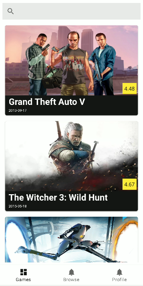

# RAWG 1.0

RAWG 1.0 is modern, slick, open source Game Tracker.

## Screenshots

   
   
   
   

## Android Development
 
* Code language in [Kotlin](https://kotlinlang.org/).
* Uses [Kotlin Coroutines](https://kotlinlang.org/docs/reference/coroutines/coroutines-guide.html) throughout.
* Uses many of the [Architecture Components](https://developer.android.com/topic/libraries/architecture/), including: Room, Lifecycle, Navigation.
    * Room
    * ViewModel
    * Navigation component
    * Lifecycle
* Uses [Hilt](https://dagger.dev/hilt/) for dependency injection
* Use Clean Architecture for application structure and modularization

## Issues & Contributions

Feel free to post problems with the app as Github Issues

Features ideas should be posted as new Github Discussion

## Contact

Twitter: https://twitter.com/AppShowly

Landing Page: www.showlyapp.com

Email: showlyapp@gmail.com
